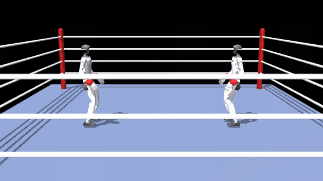
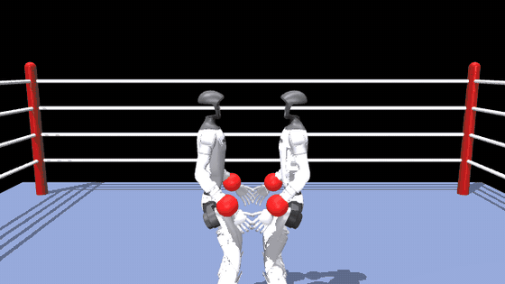

# OpenRoboxing

A boxing game for the Unitree G1 — one player fighter against another, driven through NVIDIA's
GEAR-SONIC whole-body policy and the MotionBricks motion generator, in MuJoCo, from a browser.



Two G1s under physics, each running recorded shadow-boxing combinations from the library. This is
the world the browser client draws, streamed to it as body transforms at 30 FPS.



The same fight started at punching distance. Every orange flash is a hit `runtime/contact.py`
attributed — a glove on an opponent with a real normal force — not a marker placed by eye. At the
ring's shipped starting distance a punch lands about once in eight seconds, which is why this clip
begins inside it.

> Both clips are MuJoCo renders of the simulation, **not screen captures of the web UI** — they show
> the fight, not the interface around it (no combination picker, no commit queue, no minimap).

## Install

```bash
git clone --recurse-submodules https://github.com/TriesteOpenRoboticsCommunity/OpenRoboxing.git
cd OpenRoboxing
bash install.sh
```

The installer creates `.venv_mb`, initialises the `external/gr00t-wbc` submodule, pulls its LFS
content (meshes and the MotionBricks checkpoints, several GB), and downloads the GEAR-SONIC policy
from `nvidia/GEAR-SONIC`. If you already have a GR00T-WholeBodyControl checkout, point at it and
skip the clone:

```bash
export OPENROBOXING_GR00T_ROOT=/path/to/GR00T-WholeBodyControl
bash install.sh
```

## Run

```bash
.venv_mb/bin/python -m openroboxing.tools.serve_sparring   # the debug bench, http://localhost:8081/
.venv_mb/bin/python -m openroboxing.tools.serve_match      # a hotseat match, http://localhost:8080/
```

If your shell exports a `PYTHONPATH` (ROS does), prefix these with `env -u PYTHONPATH` — see
[Environment](#environment) for why.

## Upstream

`external/gr00t-wbc` is NVlabs/GR00T-WholeBodyControl, tracking `main`, and is never modified.
The one behaviour OpenRoboxing needs from it — an authored key pose replacing the clip-sampled
target — is installed at runtime; see `src/openroboxing/spec/upstream_patches.md`.

Source is Apache-2.0. Model weights are NVIDIA's and are downloaded, not redistributed; see
`LICENSING.md`.

---

## What the game is

Two humanoids box in a physics simulation. A player picks the pose a move **ends** in, drives a
ghost of their fighter to where it should happen, and commits; **MotionBricks** in-betweens the
trajectory, the **GEAR-SONIC** policy executes it in **MuJoCo**, and physics decides the hit. Up to
five commits queue up and run back to back — run out and your fighter stops.

All of our code lives under `src/openroboxing/`. Upstream reaches us through the
`external/gr00t-wbc` submodule and is never edited — see `src/openroboxing/spec/upstream_patches.md`.

**Start here:** [`CLAUDE.md`](CLAUDE.md) — conventions, architecture invariants, known
traps. Then [`docs/WORKPLAN.md`](docs/WORKPLAN.md) — sequenced tasks with acceptance criteria.

## Play

```bash
bash install.sh --play   # hotseat match at http://localhost:8080/, once install.sh has run
```

| | pick the pose | drive the ghost | commit | unstage |
|---|---|---|---|---|
| **red** | `1`–`6` | `W A S D` | `SPACE` | `Q` |
| **blue** | `U I O J K L` | `↑ ↓ ← →` | `ENTER` | `P` |

Pick a move — that is the pose you will *end* in. Hold the drive keys to put your ghost where it
should happen, then commit: your fighter walks there and arrives in that pose. It cannot be taken
back, and neither can the four you queue behind it.

Anywhere in the ring is reachable — what a distant placement costs is **time**. The ghost says how
much (`~4.2s to walk and throw`), and the readout says **IN RANGE** when the fighters are close
enough to land. Under a queue you cannot take back, how long you are tying your fighter up for is the
decision.

Play a human against the reference agent instead:

```bash
python -m openroboxing.tools.serve_match --no-wait   # terminal 1
python -m openroboxing.tools.run_agent --seat blue   # terminal 2, then play red in the browser
```

The GEAR-SONIC checkpoints are **fetched** by `install.sh` from `nvidia/GEAR-SONIC` using upstream's
own `download_from_hf.py`. They are never redistributed by this repository — that distinction is
what [M6-T2](docs/WORKPLAN.md)'s licence review is about, and it is drawn in
[`LICENSING.md`](LICENSING.md). If the fetch fails, the installer prints the command to run by hand.

## Status

**M0–M6 substantially complete.** Two fighters box, a human can play, matches are scored, rated and
replayable, and a season can be pinned by hash. What is *not* done is listed at the bottom.

```bash
# from the repository root — each reproduces a milestone's acceptance criterion
.venv_mb/bin/python -m openroboxing.tools.env_report --quick               # M0
.venv_mb/bin/python -m pytest -q                                           # M1-T3 gate + all units
.venv_mb/bin/python -m openroboxing.tools.run_single --seconds 30          # M1-T6  one fighter
.venv_mb/bin/python -m openroboxing.tools.build_library                    # M2     pose library
.venv_mb/bin/python -m openroboxing.tools.run_match --out matches/a.json   # M3-T4  a full match
.venv_mb/bin/python -m openroboxing.tools.replay_match matches/a.json \
    --rescore --video replay.mp4                                           # M3-T5  watch / re-score
.venv_mb/bin/python -m openroboxing.tools.serve_match                      # M4-T1/T2  play it
.venv_mb/bin/python -m openroboxing.tools.latency_ab --matches 16          # M4-T2  fairness A/B
.venv_mb/bin/python -m openroboxing.tools.simulate_season                  # M5-T1  a whole season
.venv_mb/bin/python -m openroboxing.tools.score_match matches/a.json       # M5-T2  judge a match
.venv_mb/bin/python -m openroboxing.tools.run_agent --seat blue            # M5-T4  an agent plays
.venv_mb/bin/python -m openroboxing.tools.freeze_season --at <iso> --out s.json  # M6-T1
.venv_mb/bin/python -m openroboxing.tools.serve_studio                    # S-T1   author a pose
.venv_mb/bin/python -m openroboxing.tools.serve_sparring                  # the sparring bench — see below
.venv_mb/bin/python -m openroboxing.tools.measure_approach                # does an approach close? body vs plan
.venv_mb/bin/python -m openroboxing.tools.regression_check --record       # S-T3   the weight gate
.venv_mb/bin/python -m openroboxing.tools.seat_fairness --matches 20      # is a seat worth points?
```

`pytest` needs no arguments: `pyproject.toml`'s `[tool.pytest.ini_options]` sets
`testpaths = ["tests"]` and `addopts = "-m 'not slow'"`, so the end-to-end runs that build a
generator are deselected. Add `-m slow` to run them.

`serve_match` also puts a **fight-night screen** on `/screen` (M5-T3): no controls, reconnects itself
between matches, meant for a projector.

Measured on this machine: a 3 × 60 s match runs headless at **1.59× real time** — down from 2.08×
now that fighters walk to their placements, which costs generator replans; live with two
websocket clients it costs **7.7 ms of a 20 ms tick**, of which packing a frame is 0.02 ms. The
browser gets **1.7 kB per frame** (~55 kB/s) plus a one-off 8.9 MB of geometry — the JPEG stream it
replaced cost ~750 kB/s. A match writes an 85 kB record beside a 2.4 MB state trace, and every
knockdown re-derives from that trace alone with no GPU.

### Still open

| | What is missing | Why |
|---|---|---|
| M2-T6 | public release | deferred by the project owner |
| M4-T3 | a clean Windows/WSL transcript | the installer works on Linux; that box is yours |
| M4-T4 | the first bracket | needs humans in a room |
| M5-T1 | GitHub sign-in | OAuth needs an app and a secret |
| M5-T3 | fight-night screen | needs a projector and an audience |
| M6-T2 | **licence review — blocking** | a human must sign off before weights are published |

Every design decision I took that was really the owner's is in
[`docs/ASSUMPTIONS.md`](docs/ASSUMPTIONS.md), marked by how likely I am to be wrong.

| Doc | What it is |
|---|---|
| [`spec/upstream_notes.md`](src/openroboxing/spec/upstream_notes.md) | findings and traps: observation tables, the authoritative config, which G1 model is safe to simulate |
| [`spec/upstream_patches.md`](src/openroboxing/spec/upstream_patches.md) | how upstream is tracked, and the one behaviour we install at runtime |
| [`spec/rates.md`](src/openroboxing/spec/rates.md) | every canonical rate and dimension, each cited to its source |
| [`spec/constants.py`](src/openroboxing/spec/constants.py) | those constants, importable. No literals in code. |
| [`spec/intent.md`](src/openroboxing/spec/intent.md) | what a player commits: the pose, the placement, the queue |
| [`spec/protocol.md`](src/openroboxing/spec/protocol.md) | client ↔ host: the scene, binary frames, the shadow |
| [`spec/pose_record.md`](src/openroboxing/spec/pose_record.md) | a pose, and what it must survive to be admitted |
| [`spec/match_record.md`](src/openroboxing/spec/match_record.md) | what a match writes down, and what replays exactly |
| [`spec/sparring_protocol.md`](src/openroboxing/spec/sparring_protocol.md) | the sparring bench: debug stream, knobs, scrubbing |

## The sparring bench

```bash
.venv_mb/bin/python -m openroboxing.tools.serve_sparring   # http://localhost:8081/
```

Free-space debugging of the core motion stack: your fighter plus a passive sacco, no rounds and no
scoring. Queue up to **ten** commits; a clay **plan ghost** shows the reference frame the encoder is
chasing (~0.9 s ahead) with a trail to the plan's tail; an optional heatmap paints per-joint
tracking error on the robot itself. Everything is recorded — scrub any tick, download the session
as `.npz` — and the runtime's knobs (replan cadence, arrival radius, dwell, …) are live, each marked
against its canonical value. Draft poses from the Studio are accepted (`--admitted-only` restores
the match rule). Protocol: `src/openroboxing/spec/sparring_protocol.md`.

The distance strip carries **two** lines against the same placement: the body's (the pelvis under
physics, which is what ends an approach) and the plan's (the frame the encoder is chasing), with the
arrival radius drawn across it. That pair is the diagnosis of an approach, and

```bash
.venv_mb/bin/python -m openroboxing.tools.measure_approach   # one placement, eight bearings
```

scores it headlessly. First run, 2026-08-17: the plan closed to 0.02–0.19 m at every bearing, the
body to 0.007 m straight ahead and only 0.38–0.54 m off-axis, so **four of seven commits fired their
pose on the timeout instead of on an arrival**. What that means for the intent queue is written up
in [`docs/superpowers/specs/2026-08-17-event-driven-commits-and-ardy.md`](docs/superpowers/specs/2026-08-17-event-driven-commits-and-ardy.md).

## Layout

```
CLAUDE.md        conventions, invariants, traps — read before touching anything
install.sh       venv, submodule, LFS, checkpoints, editable install
pyproject.toml   the package, its dependencies, and the pytest configuration
external/
  gr00t-wbc/     NVlabs/GR00T-WholeBodyControl as a submodule. Pristine. Never edited.
src/openroboxing/
  paths.py   every path into upstream, in one place (OPENROBOXING_GR00T_ROOT overrides)
  spec/      versioned schemas, rates, constants, the upstream registry
  parity/    observation parity harness vs the C++ reference (M1)
  runtime/   intents · generator · bridge · obs · policy · world · match
  studio/    pose authoring, telegraph measurement, finetune configs
  client/    three.js ring + the shadow      server/  match host, scene, league services
  league/    Swiss pairing, Glicko-2         poses/   pose library (data, versioned)
  tools/     CLI entrypoints
tests/       unit + golden tests, fixtures under tests/fixtures/
docs/        ASSUMPTIONS.md, WORKPLAN.md, perf/, playtest/, superpowers/
```

The package directory is `src/openroboxing/`, but the package *name* is `openroboxing`: every
entry point above is `python -m openroboxing.tools.<name>`.

## Quick check

```bash
# from the repository root
.venv_mb/bin/python -m openroboxing.tools.env_report --quick
```

Prints the submodule's HEAD and how far behind `origin/main` it is, checkpoint paths + hashes, GPU,
and library versions. Exits non-zero if a required artefact is missing.

## Environment

`.venv_mb` (Python 3.10+) runs MotionBricks and MuJoCo. Four facts worth knowing before you start:

- **Importing `motionbricks...demo.controllers` requires an X display** — it imports `pynput` at
  module scope. Our headless tools must drive `full_agent` directly and never import that module.
  (`DISPLAY=:0` is a workaround for the upstream demo, not for our code.)
- **`MUJOCO_GL=egl` must be set before anything imports `mujoco`**, which is why
  `src/openroboxing/__init__.py` sets it. Rendering is offscreen and needs a GPU but no display.
- **Simulate `g1_29dof_old.xml`, never `g1_29dof.xml`.** They differ only in actuator dynamics, and
  the second has none — a PD-driven fighter built from it collapses in half a second. Use
  `paths.G1_29DOF_SIM_XML`; the trap is written up in
  [`spec/upstream_notes.md`](src/openroboxing/spec/upstream_notes.md).
- **An exported `PYTHONPATH` outranks the venv** — a venv does not shield against it. ROS is the
  common case: its `setup.bash` (usually sourced from `.bashrc`) exports
  `/opt/ros/<distro>/lib/pythonX.Y/site-packages`, and from there pytest auto-loads ROS's
  `launch_pytest` plugin, whose import chain needs `lark` (absent from `.venv_mb`) — the test
  suite dies before collecting a single test (measured 2026-08-27, ROS Jazzy). `install.sh` unsets
  `PYTHONPATH` for everything *it* runs; when invoking `.venv_mb/bin/python` yourself from a shell
  that exports one, clear it the same way:

  ```bash
  env -u PYTHONPATH .venv_mb/bin/python -m openroboxing.tools.serve_sparring
  ```

Upstream's own `external/gr00t-wbc/check_environment.py` reports Isaac Lab / `trl` / `accelerate` /
`wandb` missing. That is expected and does not block M0–M4: those are training dependencies, and the
match runtime is MuJoCo + MotionBricks + ONNX Runtime only. Isaac Lab is needed for the Studio
finetune track (S-T2), which runs on TORC hardware.
